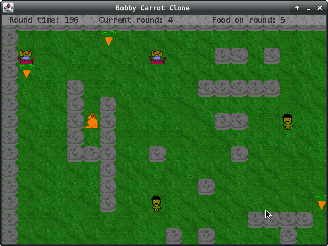

# Клон игры Bobby Carrot

## Часть 1 ( клон игры - написать проект )

#### Таск-лист

- [x] Создать главное меню.
- [x] Написать движок игры.
- [x] Написать раунды.
- [x] Каждый раунд имеет определенное время 
  которое если закончится то игрок проиграет.
- [x] Создать враждебных юнитов.
- [x] Создать ловушки.
- [x] Создать 2 типа съедобных объектов.
- [x] Возможность выигрывать/проигрывать.
- [x] Нарисовать обьекты игры. ( paint )
- [x] Использовать design pattern MVC.
- [x] Использовать IoC, DI.
- [x] Возможность преобразовать данные из файла в состояние раунда.
- [x] Использовать библиотеку для логирования. ( log4j )
- [x] Рефакторинг кода. 
- [x] Написать тесты. 

## Часть 2 ( gif || скриншоты )

